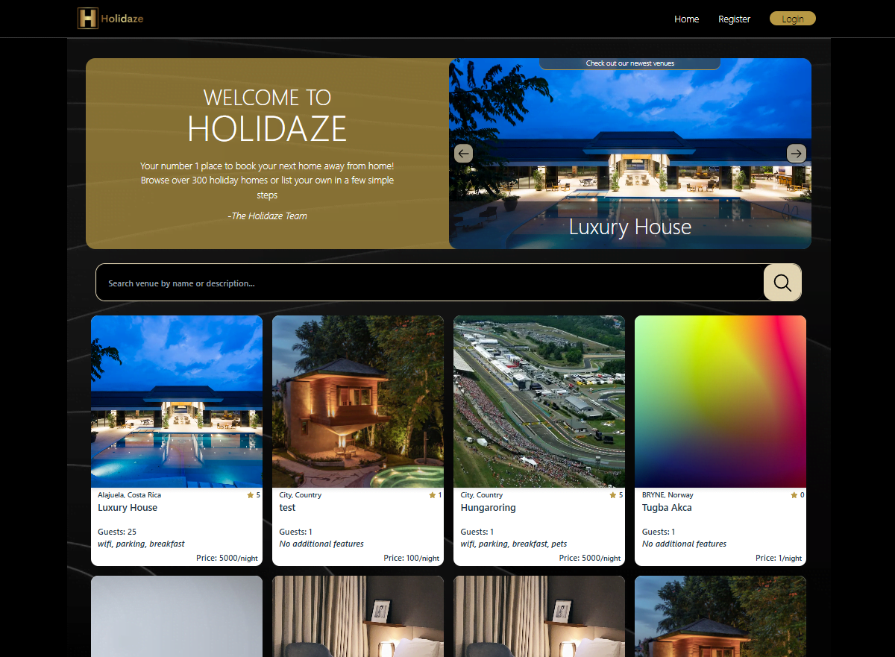

# Holidaze - Project Exam 2

 <br>

Noroff Project Exam 2, February 2025<br>
[View the website live on Netlify](https://holidaze-berrinj.netlify.app/)

## Description

This project uses React and Vite, and was designed based on a project brief and created to show off what I've learned the last two years at Noroff.

### Brief

A newly launched accommodation booking site called Holidaze has approached you to develop a brand new front end for their application. While they have a list of required features, the design and user experience has not been specified. Working with the official API documentation, plan, design and build a modern front end accommodation booking application.

There are two aspects to this brief: the customer-facing side of the website where users can book holidays at a venue, and an admin-facing side of the website where users can register and manage venues and bookings at those venues.

## Built With

- CSS
- JavaScript
- React
- React Router
- Vite
- Noroff API

## Getting Started

### Installing

1. Clone the repo:

```bash
git clone https://github.com/Berrinj/Holidaze.git
```

### Running

1. Clone the repo
2. Run repo in a code editor, I suggest using "VScode".
3. Run npm i.
4. Run npm run dev and follow link in the terminal

## Contributing

Feedback is appreciated

## Contact

[Send me an email](mailto:berremarte@gmail.com)

[www.linkedin.com](https://www.linkedin.com/in/marte-lilleberre-1013b326a/)
